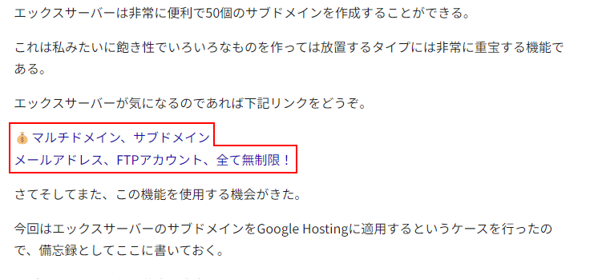

# AffiliateLinkChecker
ブログに埋め込まれたアフェリエイトリンクをチェックするChromeの拡張機能🔍🛡️

この拡張機能を有効化すると下記のURLを含むリンクが赤枠で囲まれ、リンク文字列の前に💰マークが付きます。

1. https://px.a8.net
1. https://t.afi-b.com
1. https://i.moshimo.com
1. https://af.moshimo.com/af/
1. https://h.accesstrade.net
1. https://ck.jp.ap.valuecommerce.com
1. https://click.j-a-net.jp
1. https://smart-c.jp
1. https://mttag.com
1. https://get.mobu.jp
1. https://www.infotop.jp
1. https://affiliate.docomo.ne.jp
1. https://hb.afl.rakuten.co.jp/
1. https://amzn.to
1. https://www.amazon.co.jp.*-22

URLの追加やバグ報告はGithubのIssueや[メール](mailto:nove.b.web@gmail.com)にてお待ちしております🙇‍♀️

## HOW TO USE

1. 「Code」-「Download ZIP」をクリックし、ダウンロード後、適当なフォルダに解凍してください。
2. 拡張機能の管理へ入ってください。Chromeはメニューの「その他のツール」-「拡張機能」、Edgeはメニューの「拡張機能」を選択します。
3. 拡張機能の管理ページで「開発者モード」を有効にしてください。
4. Chromeでは「パッケージ化されていない拡張機能を読み込む」、Edgeでは   「展開して読み込み」を選択して、インストールパッケージを解凍したフォルダを選択してください。

**注意：** オフラインでのインストールが完了したらPixivのページを再読み込みするか、ブラウザを再起動してください。

----------

- ダウンロードされたファイルはブラウザのダウンロードフォルダに保存されます。
- ブラウザの設定で「ダウンロード前に各ファイルの保存場所を確認する」をオフにしてください。

## example

